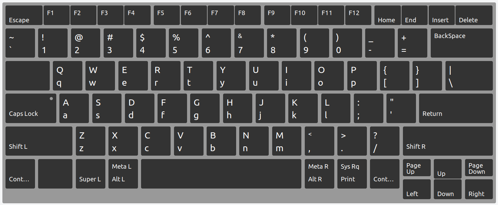

# ThinkPad X1 Carbon XKB Geometry



Here is my [XKB geometry file](x1carbon) for my Lenovo ThinkPad X1 Carbon Gen 6 with `us` keyboard layout. Note that all measurements are taken by eye. Feel free to make a pull request for improving the layout, including other X1 Carbon generations or including other country layouts.

The geometry features a CapsLock indicator.

## Setup

As I understand, XKB configuration can be quite different on different operating systems. Here's what I did on **Ubuntu 19.10** in order to get it running:

1.  Copy the [x1carbon](x1carbon) file to `/usr/share/X11/xkb/geometry/`

2.  Open `/usr/share/X11/xkb/rules/evdev` (you'll need sudo!)

    Find the section starting with
    ```
    ! model = geometry
    ```
    and add the following line somewhere in this section:
    ```
      x1carbon = x1carbon
    ```

3.  You can test the geometry by setting your model for the current X session with:
    ```
    setxkbmap -model "x1carbon"
    ```
    For viewing the geometry, I just click on the language selector dropdown at the main menu panel and select *Show Keyboard Layout*. See the above screenshot as an example of what I get there. Note that I tried setting the geometry directly, but this would not work for me for some reason.

4.  You can make the setting persistent by creating and X config file in `/usr/share/X11/xorg.conf.d/` with the specific settings. Here's the content of my config file **20-keyboard-x1carbon.conf**:
    ```
    Section "InputClass"
        Identifier "keyboard defaults"
        MatchIsKeyboard "on"

        Option "XkbModel" "x1carbon"
        Option "XkbLayout" "us,de"
        Option "XKbOptions" ""
    EndSection
    ```
    Note that you will also have to specify the layouts you want to include. You can have a look at the [ArchLinux Wiki for XKB](https://wiki.archlinux.org/index.php/Xorg/Keyboard_configuration) for an overview about setting other possible options here.
